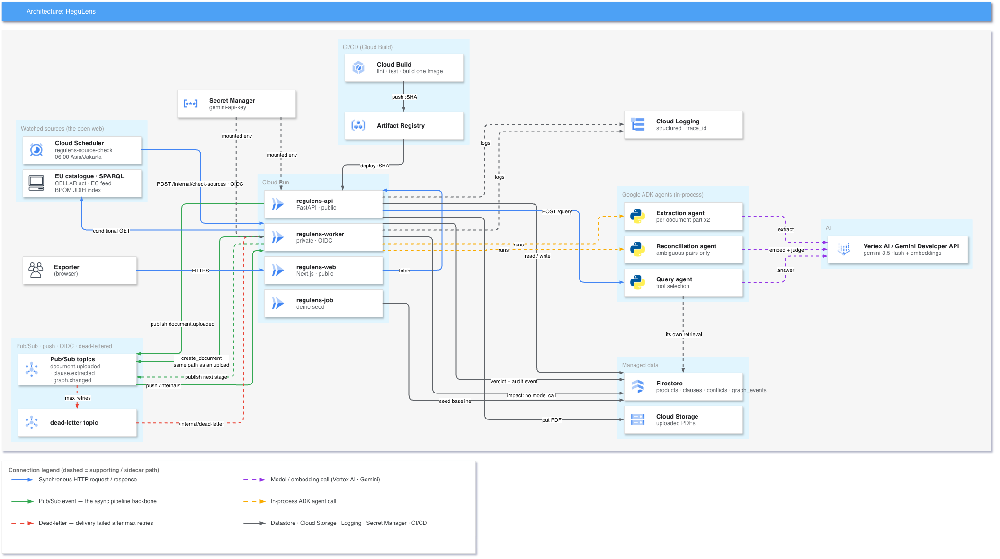

<div align="center">


# ReguLens

**Regulatory monitoring for food and beverage exporters.**

It reads regulations on its own, works out what changed, and tells you which of your
products just stopped being compliant — before anyone thinks to look.

[](https://regulens-web-babuvy7w3a-as.a.run.app)
[](api/requirements.txt)
[](web/package.json)
[](cloudbuild.yaml)
[](api/tests)

[Quick start](#quick-start) ·
[Architecture](#architecture) ·
[How it works](#how-it-works) ·
[Deploy](#deploy-to-google-cloud) ·
[Limitations](#limitations)


> **Demo video (4 min):** _link goes here_
> **Track:** Collaborative Partner · All Things Agentic Hackathon

</div>

---

Exporting a drink powder to Germany and Indonesia means obeying two sets of additive
limits that disagree with each other and change without notice. The EU caps benzoates
at 150 mg/kg; BPOM allows 400–900 mg/kg depending on the food category. Nobody emails
you when that moves.

ReguLens watches the regulators' own publications, reads new and amended rules into a
knowledge graph, and re-evaluates every product against every market it targets —
continuously, without being asked.

> [!NOTE]
> Built for a hackathon on Google Cloud. Every claim here is verifiable in the repo or
> listed under [Limitations](#limitations). No invented readiness percentages, no
> fabricated regulation text.

## Features

- **Finds regulations nobody uploaded.** A daily sweep re-reads four regulator
  addresses — the EU Publications Office catalogue, one specific EU act, the
  Commission's food-safety feed, and BPOM's legal portal. Three of the four *discover*:
  they surface acts at addresses the system has never seen. On the deployed stack this
  has moved a real verdict: Commission Regulation (EU) 2023/2108 was found at CELLAR,
  read into 88 verbatim limits, and failed a cured sausage on the 30 mg/kg nitrite row
  that entered into force on 9 October 2025. Nobody uploaded it.
- **Finds the addresses too, for a country nobody seeded.** `POST /countries/discover`
  asks **Gemma** for the two things a model gets right — the regulator's name and its
  root domain — and reads every path off pages actually fetched. The model picks an
  index from a link inventory we hand it; a pick that is not in the list is dropped.
  Measured on 31 Aug over six countries: regulator names 6/6, root domains 6/6, and
  every model-written *path* wrong, which is why it is never asked for one.
- **Extracts rules, not summaries.** Clauses come out verbatim with a substance, a
  limit, a unit and a citation, then get a computed confidence score.
- **Refuses to guess.** A deterministic guardrail decides whether two clauses may even
  be compared. Anything uncertain or low-authority goes to a human review queue instead
  of silently moving a limit.
- **Flips verdicts on its own.** When a rule changes, affected products change status
  and an alert names the regulation that caused it — and whether anybody uploaded it.
- **Answers questions with citations** — over the API. `POST /query` runs the ADK
  Query agent, which picks its own retrieval tools, and every clause id it returns is
  validated in code against what retrieval actually served, so an invented id cites
  nothing. **Not wired into the web app**: there is no Ask box on any page yet, and the
  agent is strict enough that a question phrased around a market rather than a substance
  comes back as a refusal. Both are listed under [Limitations](#limitations).

## Quick start

Runs entirely on emulators. No Google Cloud account, no API key, no cost. Docker is the
only prerequisite.

```bash
git clone https://github.com/aliefauzan/ReguLens.git
cd ReguLens
make run
```

Open <http://localhost:3000> and press **Try it with sample data** — that creates a
product and ingests the Indonesian rule through the real pipeline. Then **Add rules →
Rules we already have** to feed it the EU limit, and watch the verdict flip on its own. [`docs/USER_GUIDE.md`](docs/USER_GUIDE.md) walks the same path in plain language.

Verify the whole thing offline, from a clean checkout:

```bash
make test-all
```

```
STEP                         RESULT
----                         ------
ruff (api)                   PASS
pytest (api)                 PASS
tsc (web)                    PASS
next build (web)             PASS
local e2e drill              PASS
```

`make help` lists the rest.

> [!TIP]
> `FAKE_LLM=1` is set in `docker-compose.yml`, so the local stack exercises the real
> pipeline — Pub/Sub push, the guardrail, the audit trail — without calling a model.
> Document reading is simulated; everything around it is the code that ships.

## Architecture



Two ways in, one pipeline — and a third way to acquire an *address*, which is not the
same thing as a way into the graph:

```
A. A person uploads a PDF or pastes text
B. Cloud Scheduler (06:00 daily) → worker re-reads every watched address
     nothing changed  → a conditional GET and a hash comparison. No model call.
     something changed → create_document — the SAME call an upload makes

                  both paths publish → Pub/Sub: document.uploaded
                                              ↓ push, OIDC
   /internal/document-uploaded → extract (Extraction Agent ×2) → clause.extracted
   /internal/clause-extracted  → reconcile (guardrail; agent only when ambiguous) → graph.changed
   /internal/graph-changed     → impact (pure code, no model) → Firestore verdict + audit event
   /internal/dead-letter       ← any topic after max retries
```

There is no third way in. A regulation discovered by the scheduler is hashed, stored,
extracted, guardrailed and reviewed exactly as an upload is. Country discovery
(`POST /countries/discover`, Gemma) does not touch this pipeline at all: it produces a
watched *address*, which the 06:00 sweep then reads through path B like every other.

The diagram is generated, not drawn — regenerate it with `make diagram`.

### Tech stack

| Layer | Choice |
|---|---|
| API & worker | FastAPI on Cloud Run, one container image |
| Web | Next.js 16 (App Router), React 19, TypeScript, Tailwind 4 |
| Agents | Google ADK |
| Models | Gemini 3.5 Flash + embeddings, via Vertex AI or the Gemini Developer API; **Gemma** (`gemma-4-31b-it`) for country discovery |
| Events | Pub/Sub push subscriptions, OIDC-authenticated, dead-lettered |
| Data | Firestore (native), Cloud Storage |
| Scheduling | Cloud Scheduler → worker, daily |
| CI/CD | Cloud Build → Artifact Registry → Cloud Run |
| Secrets | Secret Manager, mounted with `--set-secrets` |

## How it works

### Watching for changes

`/sources` is the watch list. Four kinds of address, because "changed" means four
different things:

| Kind | What a change means | Can it find a rule you've never seen? |
|---|---|---|
| `document` | The wording of one known act moved | No |
| `feed` | A new RSS/Atom entry appeared | Yes |
| `listing` | A new link on a regulator's index page | Yes |
| `sparql` | A new act in a publisher's catalogue | Yes |

Three details that took real debugging:

- **A change means the *wording* changed, not the bytes.** EUR-Lex stamps a fresh
  session id into every response, so a byte hash would report a change — and bill a
  model run — every single night. The signal is a hash of the extracted text.
- **What works from a laptop may not work from Cloud Run.** EUR-Lex answers a
  datacentre address with `202` and a challenge page. The EU source therefore points at
  CELLAR, the Publications Office's machine-readable endpoint, which serves the same
  regulation *and* sends an `ETag`.
- **A broken source says so.** A 403, a login wall, a PDF with no text layer — each is
  recorded and rendered. A source erroring quietly for a week means nobody is watching it.

### Why the answers are trustworthy

- **Deterministic code owns every mutation.** A model response never reaches Firestore
  without passing a Pydantic validator and the guardrail.
- **The engine doesn't know it's a web app.** `api/app/core/` imports neither FastAPI
  nor ADK — checkable with one grep. Agents live in four files whose tool bodies are
  plain functions in `core/`, so every decision runs and tests without an agent framework.
- **Confidence is computed, not self-reported:**
  `0.3·parse_quality + 0.4·self_consistency + 0.3·authority_tier`. Low-authority sources
  are capped by construction and routed to review.
- **Audit trail.** Every state change writes an immutable `graph_events` record in the
  same batch as the change itself. There is no raw update method to reach around.
- **An alert says why.** A moved verdict names the regulation that moved it, and whether
  anybody uploaded it. `GET /stats/autonomy` counts the same claim from stored records.
- **Rules that can't apply to you aren't put in front of you.** The review queue is
  filtered to what could affect products in the workspace, recomputed on every read.
  Nothing is deleted, and the queue always states how many rules it is holding back and why.

### The agents

| Agent | Runs | Honest label |
|---|---|---|
| Extraction | every document, twice per part | pipeline, one LLM step |
| Reconciliation | only on a genuinely ambiguous pair | code decides, agent advises |
| Query | every question | genuinely agentic — picks its own retrieval tools |
| Impact | every graph change | **no agent and no model call at all** |

Impact is arithmetic — turning a limit and a measured amount into pass or fail — and
arithmetic should not be delegated to a model.

## Deploy to Google Cloud

You edit one file and run one script.

```bash
cp regulens.env.example regulens.env   # set PROJECT_ID
./scripts/quickstart.sh
```

That provisions Firestore, Cloud Storage, Pub/Sub topics with dead-lettering, service
accounts with narrow IAM, and the Cloud Scheduler job, then deploys three Cloud Run
services (`api`, `worker`, `web`) and one seed Job. The api, worker and job all run the
same container image.

> [!IMPORTANT]
> `scripts/setup.sh` is idempotent — running it twice is a no-op, not an error. Re-run
> it after the first deploy so the Pub/Sub push subscriptions can point at the worker's URL.

Only `PROJECT_ID` is required. `GEMINI_API_KEY` is optional: set it to use the Gemini
Developer API free tier, leave it unset to bill through Vertex AI. Both work; a missing
secret is a cost line, not an outage.

### Configuration

One file, `regulens.env` (copy from `regulens.env.example`). A real environment variable
always wins over it, so CI needs no file.

| Variable | Default | Purpose |
|---|---|---|
| `PROJECT_ID` | *required* | GCP project. The fallback is deliberately not a real project |
| `REGION` | `asia-southeast1` | Cloud Run, Firestore, Pub/Sub |
| `GEMINI_MODEL` | `gemini-3.5-flash` | Generation model |
| `GEMINI_API_KEY` | unset | set → Gemini Developer API; unset → Vertex AI |
| `FAKE_LLM` | off | deterministic offline mode |
| `SOURCE_CHECK_INTERVAL_HOURS` | `24` | how often a watched address is re-read |
| `MAX_FETCH_CHARS` | `200000` | a document past this is refused, not truncated |

`regulens.env.example` carries the full set, each with the reasoning behind its default.

## Project structure

```
api/app/main.py        API: upload, products, clauses, conflicts, query, sources
api/app/worker.py      Pub/Sub consumers + the scheduled source sweep
api/app/core/          the engine — framework-free, no FastAPI, no ADK
api/app/adk/           the four agents; tool bodies live in core/
api/tests/             601 tests + fixture corpus
web/                   Next.js app
data/regulations/      the real source PDFs, with provenance in SOURCES.md
scripts/setup.sh       idempotent GCP provisioning
scripts/quickstart.sh  clone → running stack, one command
docs/architecture.py   generates docs/architecture.svg + .png
plan/                  build plan and per-phase evidence
```

## Limitations

Things this does not do. The list is here so nobody discovers them in a demo.

- **Numeric limits only** are evaluated pass/fail. Labelling, certification and
  documentation clauses are extracted and surfaced as `needs_review`, never silently
  counted as checks that ran.
- **No OCR.** PDFs need a text layer, whether uploaded or fetched.
- **Watching is a scheduled re-read, not a subscription.** The floor on noticing a
  change is the check interval — 24 hours by default — because no regulator in the
  corpus publishes a webhook.
- **A discovered source is an index, not a rule.** `POST /countries/discover` finds a
  regulator's regulations index for a country nobody seeded, and stops there: it
  commits a `listing` to watch, and the ordinary sweep is what reads anything from it.
  It also fails openly — a regulator publishing through a JavaScript application
  returns "the index has no links we can follow" rather than an empty success.
- **The query agent has no UI and refuses more than it should.** Asked about a market
  ("the nitrite limit for cured meat in Germany") it answers `INSUFFICIENT_EVIDENCE`
  even while holding the clause the product page cites; asked about a substance it
  answers, but the model does not always emit the bracketed ids the validator counts,
  so an answer can arrive with zero citations. The refusal path is the safe one and it
  is the one that fires; the wiring and the citation enforcement are unfinished.
- **The EU catalogue query is scoped to one subject** (*food additive*). A regulation
  about contaminants or packaging falls outside it. Deliberate — unscoped, the query
  returns everything the EU publishes.
- **A listing only sees what its index page shows.** BPOM's front page carries twelve
  items; a regulation published and pushed off that list between checks would be missed.
- **One hardcoded workspace, no auth.** `/internal/*` routes are private and OIDC-gated —
  that is the security boundary that matters here.
- **Latency scales with how many rules a document contains.** Measured on the deployed stack:

  | Document | Clauses | Total |
  |---|---|---|
  | One pasted rule | 1 | **25.5s** |
  | EU Annex II excerpt, 4 pages | 55 | **174.3s** |

  Extraction is ~72% of the annex figure and is bound by output tokens. The 90s target
  holds for announcement-sized documents and does not hold for a dense annex.

### Deliberate choices, not shortfalls

- The substance-family table (benzoates, sorbates, and the curing salts — nitrites
  E 249-250, nitrates E 251-252) is documented domain mapping, not inferred
  equivalence. Every source regulation states the shared basis on the limit row
  itself: the level applies to the group, so the row was written about the group.
- Readiness shows issue counts, not a percentage. A percentage needs a denominator — the
  number of rules that *should* apply — which nobody has.

## Resources

| | |
|---|---|
| [Live app](https://regulens-web-babuvy7w3a-as.a.run.app) | The deployed stack |
| [`docs/USER_GUIDE.md`](docs/USER_GUIDE.md) | Plain-language walkthrough, no cloud knowledge assumed |
| [`plan/PROGRESS.md`](plan/PROGRESS.md) | Per-item evidence: drill results, fixture accuracy, latency, trade-offs |
| [`data/regulations/SOURCES.md`](data/regulations/SOURCES.md) | The real regulation corpus, with checksums and provenance |
